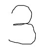

# 画像の読み込み
2019/09/25

## 概要

サンプルとして以下の画像( `sample.png` )を読み込むとする。
(100, 100, 3)




## kerasを使った画像の読み込み

```py
from keras.preprocessing.image import load_img, img_to_array, array_to_img
COLOR = "grayscale"   # "rgb", "rgba", "grayscale"
IMG_SIZE = (50,50)    # 画像サイズ
img = load_img("./sample.png",color_mode=COLOR,target_size=IMG_SIZE)
```

#### おまけ

読み込んだ画像を確認したい場合

```py
from matplotlib import pyplot as plt
plt.imshow(img , cmap = "gray")
plt.show()
```

### numpy配列に変換する

```py
img_array = img_to_array(img) # numpy配列に変換
print(img_array.shape)        # 配列の形が確認できる
```

#### おまけ： numpy配列の保存と読み込み

- 保存
```py
np.save("./sample.npy", img_array)
```

- 読み込み
```py
LOAD_PATH = "./sample.npy"
img_array = np.load(LOAD_PATH)
```


#### おまけ：numpy配列の軸の変更
例：(height ,weight, chanel) を　(chanel, height, weight)に変更する。

```py
# (height(0) ,weight(1), chanel(2)) -> (chanel(2), height(0), weight(1))
img_array = mg_array.transpose(2,0,1) 
print(img_array.shape)
```

### 画像の値を0~1の値に抑える 

```py
img_array = img_array/255
```

### numpyをimgに変換する

```py
img = array_to_img(img_array)
```

### 画像の保存 (keras)

```py
from keras.preprocessing.image import load_img, save_img, img_to_array, array_to_img
COLOR = "grayscale"   # "rgb", "rgba", "grayscale"
IMG_SIZE = (50,50)    # 画像サイズ
img = load_img("./sample.png",color_mode=COLOR,target_size=IMG_SIZE)
img_array = img_to_array(img) # ndarrayに変換
save_img("./new_sample.png", img_array)
```

## opencv を使って画像を読み込む

```py
import cv2
IMAGE_SIZE = 32[
IMG_PATH = "./sample.png"
img = cv2.imread(IMG_PATH)
if img is None:
	print("ERROR", DIR_PATH)
else:
	img = cv2.resize(img, (IMAGE_SIZE, IMAGE_SIZE))
```

