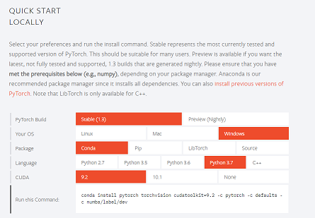

# pytorch 導入編

## インストール

[https://pytorch.org/](https://pytorch.org/)

上記公式のクイックスタートを見ると良い。  
自身の環境を選択すると、インストールするためのコマンドを出力してくれて便利。



コマンドを実行してインストール開始。  
おわり。

!!! WARNING
    tensorflowやkerasで環境をすでに作成している人は新しい仮想環境を作成するなどpytorch用の環境を別で作成したほうが良いかもしれません。
    大丈夫かもしれませんが。(cudatoolkitあたりのバージョン変ったりして影響あるかも?)

## 動作確認


```py
import torch
device = torch.device("cuda:0" if torch.cuda.is_available() else "cpu")
print(device)
```

CUDAが使えるかどうかの確認も含む。  
cuda:0 と出れば使用可能。`cpu` と出たら使えない。


??? ヒント
    できない場合は今一度CUDAのバージョンを確認してください。
    ~~私はそれで1時間を溶かしました...。~~  
    Windowsで確認は以下でできます。
    ```sh
    nvcc -V
    ```

使用可能なだけで、それだけで自動ですべてやってくれるわけではないらしいことに注意。  
それについては別ページでも説明する。

epochごとのループでinputとlabel(target)をGPUに送る必要がある。

```py
net = Net()
net.to(device)
for i, data in enumerate(trainloader, 0):
    inputs, labels = data[0].to(device), data[1].to(device)
    ...
```

!!! memo
    enumerate() の第二引数はインデックスの開始数値らしい...。

- - -
おわりー
(2019/10/22)