# Anacondaによる環境構築(Win)

2018/09/27

Windows10での環境構築をベースとします。
Linux系でも流れは同じはず…。

Anacondaのインストールからjupyter notebookでプログラムが書けるようになるまでの流れです。

## インストール

Anacondaのページにいってぽちっとする。

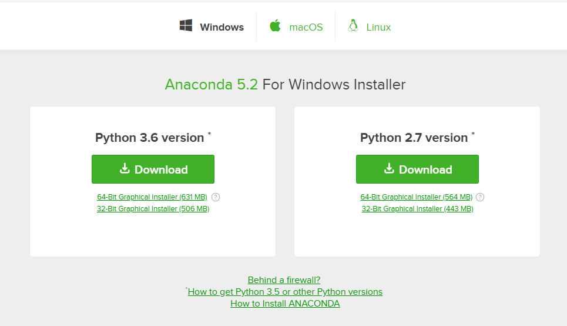

`Anaconda3-5.2.0-Windows-x86_64.exe`
をどこに保存されるか聞かれるのでわかるところに置いておく。

チートシートほしいならEメール登録してと言われるが無視。  
入力場所じゃないところをクリックすると消える。

`Anaconda3-5.2.0-Windows-x86_64.exe` を実行する。

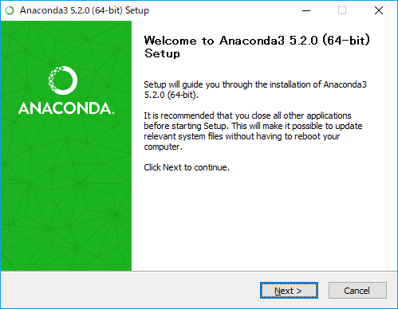

next ,I agree, next... と進めていく。

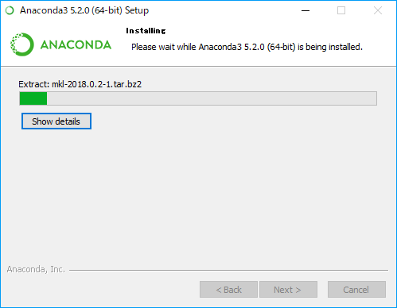

待機。

ゲージがたまったらnext

vsCodeが必要なければ、とりあえずskip

そのままfinishすると  
http://docs.anaconda.com/anaconda/user-guide/getting-started/  
と、  
https://anaconda.org/  
に飛ばされる。

anacondaの使い方（英語）とAnacondaクラウドの登録っぽいあれなので無視してもよい。  
もしくはfinishする前にチェックを外しておく。

ここまででインストールは終了。

## 起動

スタートのアプリ覧を見ると、「最近追加されたもの」にAnaconda関連のものが加わっていることが分かる。  
検索してもよい

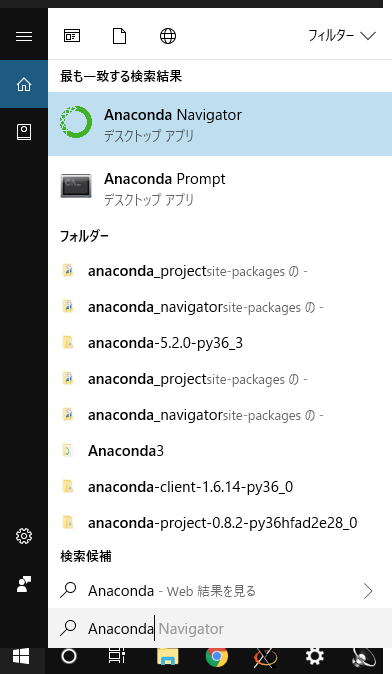

Anaconda Navigaterを起動する。

しばらく待って起動すると以下がでてくる。

`Ok, and don't show again` する。チェックを外しても良い。

起動画面はこれ

jupyter notebookを `Launch` (起動)する。

ブラウザが立ち上がってjupyter notebookが起動する。

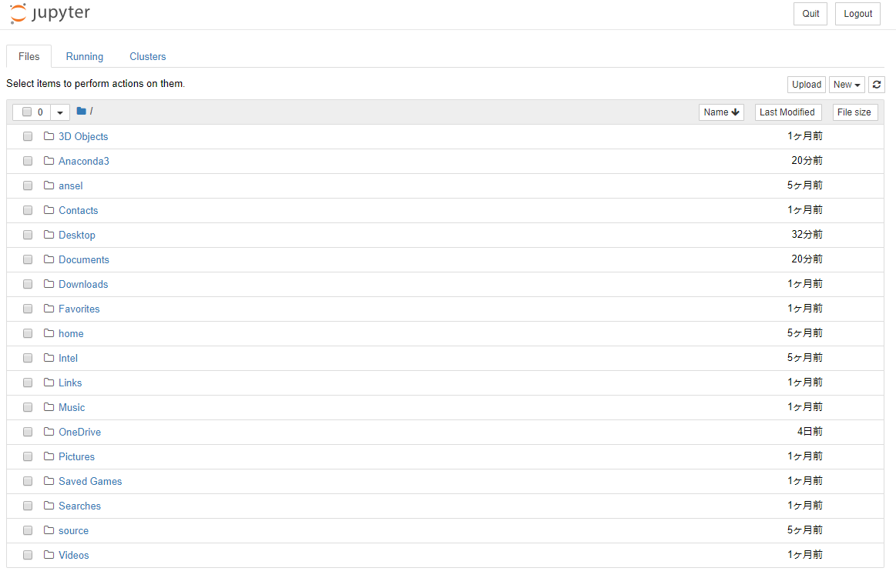

## jupyterの基本

### フォルダの作成

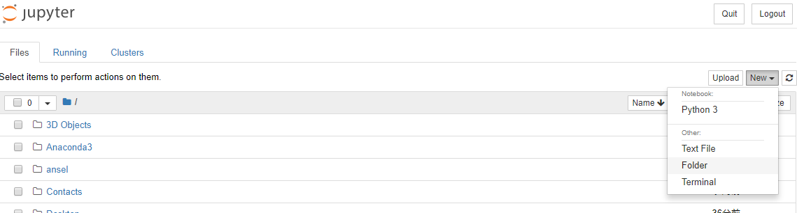

Folderをクリックすると、  
新しく、`Untitled Folder` が作成される。  
追加されたフォルダは一番上に追加されなるわけでもなく、追加しましたって通知がくるわけでもないので注意。  
アルファベット順に見ていくと追加されているのが分かる。「U」 なので結構下の方にある。

### フォルダのソート

右上のほうの `Name`  `LastModified` などでソート順を変えることも可能。

### リネーム

フォルダ名の変更は左上の `Rename` から行える。

変更したいフォルダにチェックをうってから `Rename` をクリック。

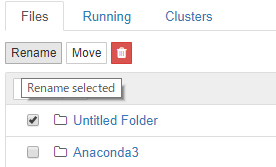

フォルダ名を入力し、右下の`Rename`

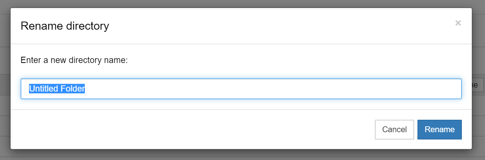

## pythonファイルを書く

Pythonファイルをかき始めるには
右上の `new` から `python3` を選択する。

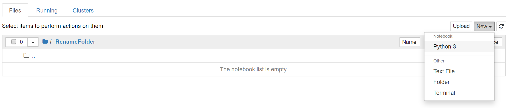

以下の画面が出てくる。

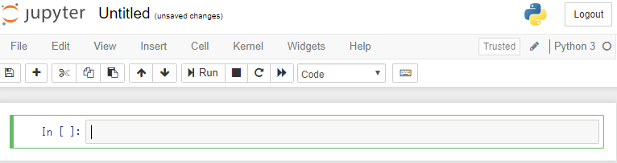

タイトルの変更はUntitledの場所をクリックすればよい。もしくはフォルダ名の変更と同様のやり方で行う。

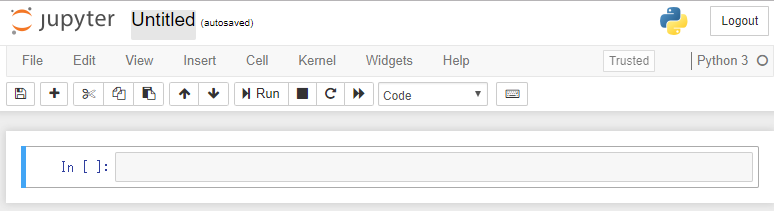

## 保存してあるpython notebook(.ipynb) を読み込む

右上のuploadをクリックする。

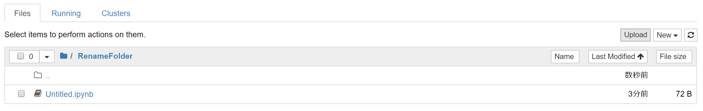

読み込みたいファイルを探し、開く。

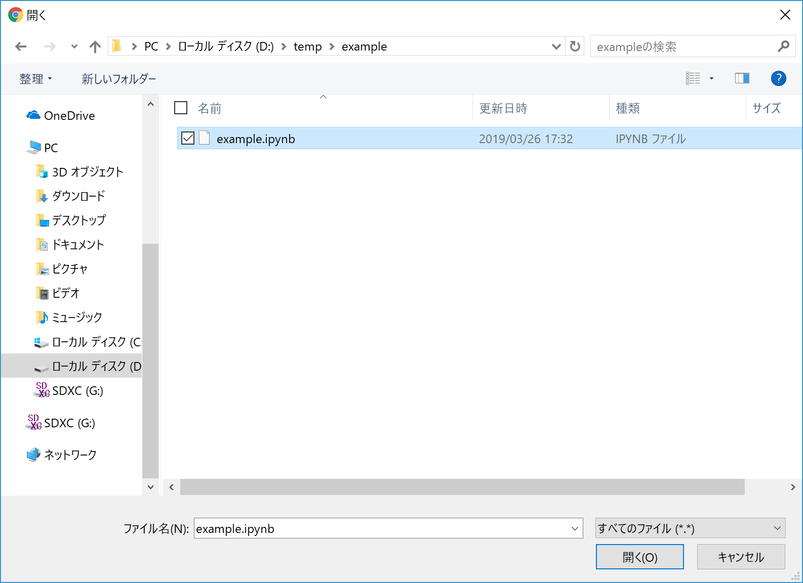

名前の変更も行える。
右の青いボタン（``Upload`` ）をクリック。

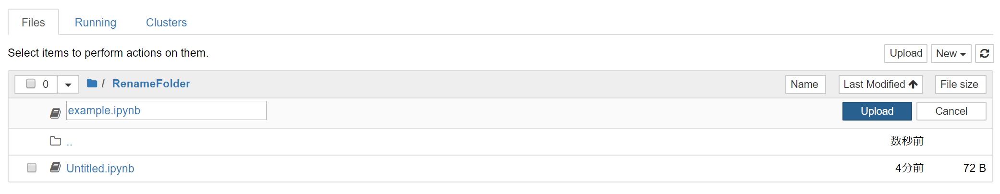

以上で追加される。

## markdownの書き方

jupyter notebook上ではコメントを書くことができる。

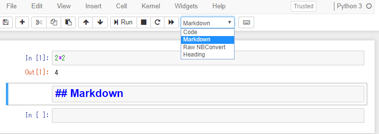
